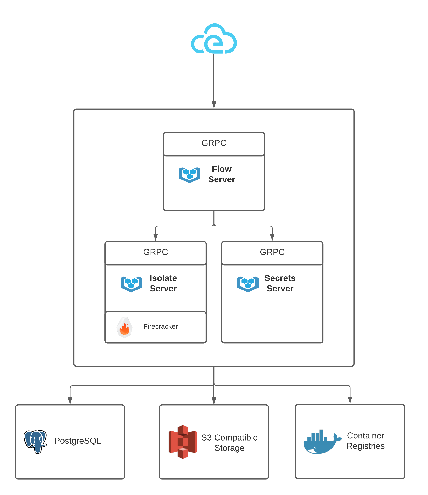

# direktiv

<br />
<p align="center">
  <a href="https://github.com/vorteil/direktiv">
    
  </a>
    <h5 align="center">event-based serverless container workflows</h5>
</p>
<hr/>


[](https://github.com/vorteil/direktiv/actions/workflows/build.yml) <a href="https://codeclimate.com/github/vorteil/direktiv/maintainability"></a> [](https://goreportcard.com/report/github.com/vorteil/direktiv) [](https://discord.gg/VjF6wn4)

Direktiv is a specification for a serverless computing workflow language that aims to be simple and powerful above all else.

Direktiv defines a selection of intentionally primitive states, which can be strung together to create workflows as simple or complex as the author requires. The powerful `jq` JSON processor allows authors to implement sophisticated control flow logic, and when combined with the ability to run Docker containers as part of Direktiv workflows just about any logic can be implemented. Workflows can be triggered by CloudEvents for event-based solutions, can use cron scheduling to handle periodic tasks, and can be scripted using the APIs for everything else.

This repository contains a reference implementation that runs Docker containers as isolated virtual machines on [Firecracker](https://github.com/firecracker-microvm/firecracker) using [Vorteil.io](github.com/vorteil/vorteil).

<p align="center">
  
</p>

## Quickstart

### Starting the Server


### Creating and Running a Workflow

The following script does everything requireq to run a first workflow. This includes
creating a namespace & workflow and running the workflow the first time.  

```sh
$ direkcli namespaces create demo
Created namespace: demo
$ cat > helloworld.yml <<- EOF
id: helloworld
states:
- id: hello
  type: noop
  transform: '{ msg: ("Hello, " + .name + "!") }'
EOF
$ direkcli workflows create demo helloworld.yml
Created workflow 'helloworld'
$ cat > input.json <<- EOF
{
  "name": "Alan"
}
EOF
$ direkcli workflows execute demo helloworld --input=input.json
Successfully invoked, Instance ID: demo/helloworld/aqMeFX <---CHANGE_THIS_TO_YOUR_VALUE
$ direkcli instances get demo/helloworld/aqMeFX
ID: demo/helloworld/aqMeFX
Input: {
  "name": "Alan"
}
Output: {"msg":"Hello, Alan!"}
```

### Code of Conduct

We have adopted the [Contributor Covenant](https://github.com/vorteil/.github/blob/master/CODE_OF_CONDUCT.md) code of conduct.

### Contributing

Any feedback and contributions are welcome. Read our [contributing guidelines](https://github.com/vorteil/.github/blob/master/CONTRIBUTING.md) for details.

## License

Distributed under the Apache 2.0 License. See `LICENSE` for more information.

## See Also

* The [direktiv.io](https://direktiv.io/) website.
* The [vorteil.io](https://github.com/vorteil/vorteil/) repository.
* The Direktiv [documentation](https://docs.direktiv.io/).
* The [Direktiv Beta UI](http://wf.direktiv.io/).
* The [Godoc](https://godoc.org/github.com/vorteil/direktiv) library documentation.
