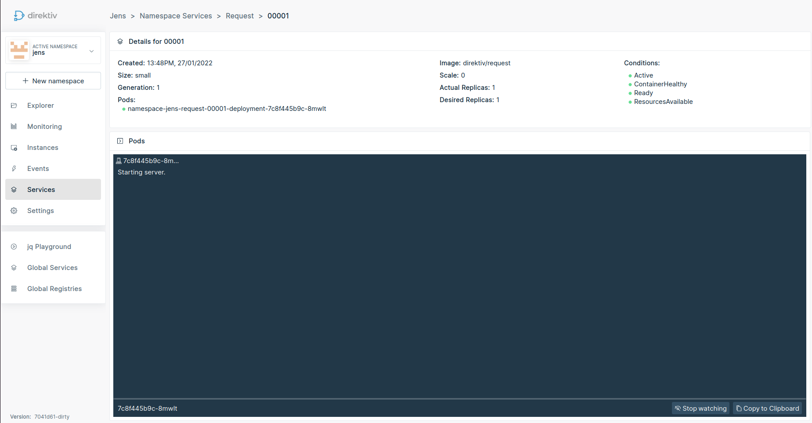
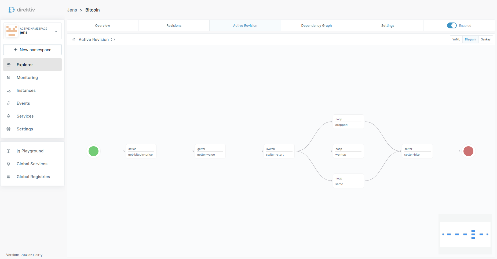
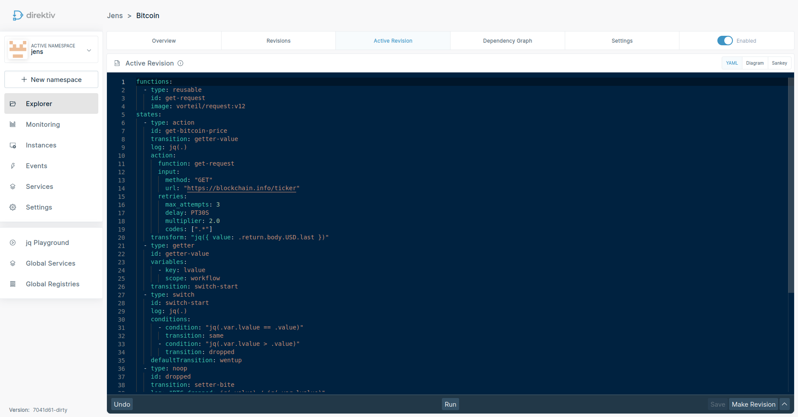
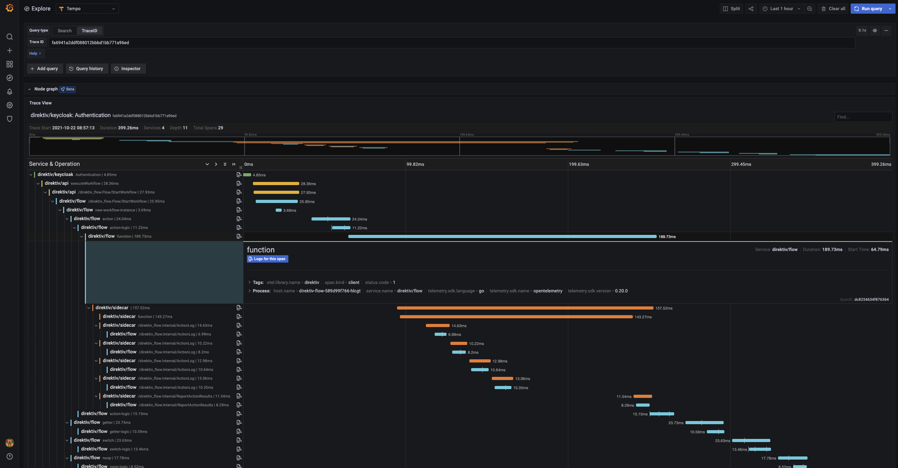
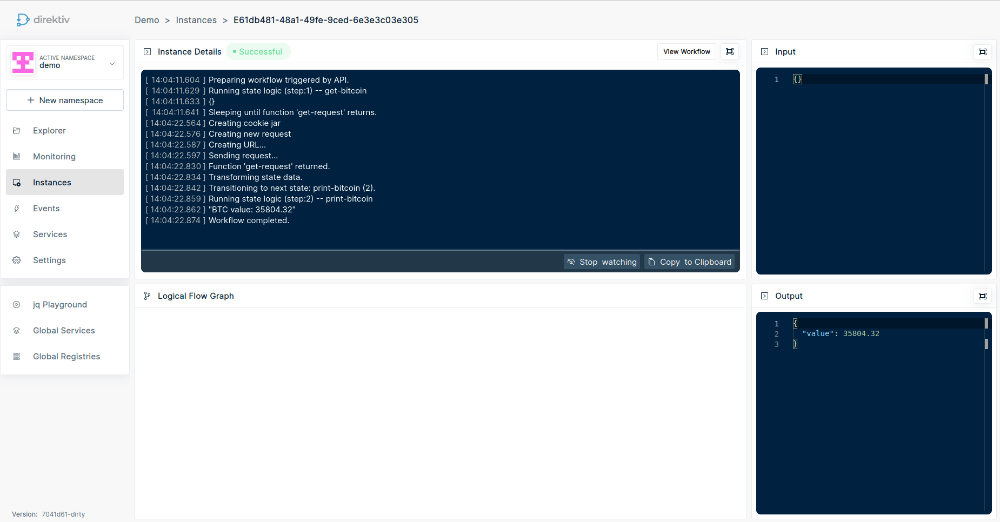

<p align="center">
  
</p>

<br>

<div align="center">

[](#license)
[](https://goreportcard.com/report/github.com/direktiv/direktiv) 
[](https://github.com/direktiv/direktiv/releases/)
[](https://github.com/direktiv/direktiv/stargazers/)
[](https://github.com/direktiv/badges/graphs/contributors/)
[](https://github.com/direktiv/direktiv/graphs/commit-activity)
[](https://go.dev/)
[](https://join.slack.com/t/direktiv-io/shared_invite/zt-zf7gmfaa-rYxxBiB9RpuRGMuIasNO~g)

</div>


<h1 align="center">Event-Driven Serverless Orchestration, Integration and Automation</h1>
<div align="center">
Run Workflows and Create Services in Seconds
</div>
</br>

<p align="center">
    <a href="https://docs.direktiv.io">Documentation</a>
    .
    <a href="https://blog.direktiv.io">Blog</a>
    . 
    <a href="https://github.com/direktiv/direktiv/issues/new?assignees=&labels=&projects=&template=bug_report.md&title=">Report Bug</a>
    ·
    <a href="https://github.com/direktiv/direktiv/issues/new?assignees=&labels=&projects=&template=feature_request.md&title=">Request Feature</a>
</p>


<div align="center"></div>

## Features & Standards

* __YAML__: Define flows and subflows with simple YAML including if/else switches, error handling, retries and validations.
* __Serverless__: Call multiple serverless functions from a flow and merge and modify the responses.
* __Event-Based__: Catch events within the system or from external sources like AWS or Github.
* __JSON Inputs & States__: Use JSON as input for flows and respond with JSON to the caller.
* __API Gateway__: Includes an API gateway to expose flows as services for third-party consumers.
* __CloudEvents__: Supports CNCF's [CloudEvents](https://cloudevents.io/).
* __GitOps Approach__: All configurations, services and flows can be synced from Git.
* __Observability__: Integrated into Prometheus (metrics), Fluent Bit (logging) & OpenTelemetry (instrumentation & tracing).
* __Periodic Tasks__: Call flows periodically via cron jobs. 
* __Scalable__: Direktiv scales on flow as well as function level with [Knative's](https://knative.dev/docs/) and Kubernetes scaling approach.
* __Easily Extendable__: Add custom functions with simple Docker containers.


# What is direktiv?

Direktiv is an event-driven container orchestration engine, running on Kubernetes and Knative. The following key concepts:

- direktiv runs containers as part of workflows from any compliant container registry, passing JSON structured data between workflow states.
- JSON structured data is passed to the containers using HTTP protocol on port 8080.
- direktiv uses a [primitive state declaration specification](https://docs.direktiv.io/spec/workflow-yaml/workflow/) to describe the flow of the orchestration in YAML, or users can build the workflow using the workflow builder UI.
- direktiv uses `jq` JSON processor to implement sophisticated control flow logic and data manipulation through states.
- Workflows can be event-based triggers ([Knative Eventing](https://knative.dev/docs/eventing/) & [CloudEvents](https://cloudevents.io/)), cron scheduling to handle periodic tasks, or can be scripted using the APIs.
- Integrated into [Prometheus](https://prometheus.io/) (metrics), [Fluent Bit](https://fluentbit.io/) (logging) & [OpenTelemetry](https://opentelemetry.io/) (instrumentation & tracing).

Additional resources to get started:

- Pre-built plugins are available from [https://github.com/direktiv/direktiv-apps](https://github.com/direktiv/direktiv-apps) - we're working hard to add more every day!
- Examples for integration your own containers [https://github.com/direktiv/direktiv-apps/tree/main/examples](https://github.com/direktiv/direktiv-apps/tree/main/examples) with an explanation [here](https://docs.direktiv.io/getting_started/).

<table>
  <tr>
    <th>Knative Services</th>
    <th>Orchestration Flow</th>
  </tr>
  <tr>
    <td></td>
    <td></td>
  </tr>
  <tr>
    <th>YAML definition</th>
    <th>OpenTelemetry Integration</th>
  </tr>
  <tr>
    <td></td>
    <td></td>
  </tr>  
</table>


# Why use direktiv?

- *Cloud agnostic*: direktiv runs on any platform, supports any code and is not dependent on cloud provider's services for running workflows or executing actions
- *Simplicity*: the configuration of the workflow components should be simple more than anything else. Using only YAML and `jq` you should be able to express all workflow states, transitions, evaluations, and actions needed to complete the workflow
- *Reusable*: if you're going to the effort and trouble of pushing all your microservices, code or application components into a container platform why not have the ability to reuse and standardise this code across all your workflows? We wanted to ensure that code always remains reusable and portable without the need for SDKs (or vendor specific language).

# Quickstart

## Running a local direktiv instance (docker)

Getting a local playground environment can be easily done with Docker. The following command starts a docker container with kubernetes. *On startup it can take a few minutes to download all images.* When the installation is done all pods should show "Running" or "Completed".

```sh
docker run --privileged -p 8080:80 -ti direktiv/direktiv-kube
```

> If the upper limit for inotify instances is too low the pods might be stuck in *pending*. Increase that limit if necessary: 

```console
sudo sysctl fs.inotify.max_user_instances=4096
```

***Testing Installation:***

Browse the UI: http://localhost:8080

... or ...

verify direktiv is online manually from the command-line using `cURL`:

```sh
$ curl -vv -X PUT "http://localhost:8080/api/namespaces/demo"
{
  "namespace": {
    "createdAt": "2021-10-06T00:03:22.444884147Z",
    "updatedAt": "2021-10-06T00:03:22.444884447Z",
    "name": "demo",
    "oid": ""
  }
}
```

## Kubernetes Install

For full instructions on how to install direktiv on a Kubernetes environment go to the [installation pages](https://docs.direktiv.io/installation/)


## Creating your first workflow

The following script does everything required to run the first workflow. This includes creating a namespace & workflow and running the workflow the first time.  

```bash
$ curl -X PUT "http://localhost:8080/api/namespaces/demo"
{
  "namespace": {
    "createdAt": "2021-10-06T00:03:22.444884147Z",
    "updatedAt": "2021-10-06T00:03:22.444884447Z",
    "name": "demo",
    "oid": ""
  }
}
$ cat > helloworld.yml <<- EOF
states:
- id: hello
  type: noop
  transform:
    msg: "Hello, jq(.name)!"
EOF
$ curl -vv -X PUT --data-binary "@helloworld.yml" "http://localhost:8080/api/namespaces/demo/tree/helloworld?op=create-workflow"
{
  "namespace": "demo",
  "node": {...},
  "revision": {...}
}
$ cat > input.json <<- EOF
{
  "name": "Alan"
}
EOF
$ curl -vv -X POST --data-binary "@input.json" "http://localhost:8080/api/namespaces/demo/tree/helloworld?op=wait"
{"msg":"Hello, Alan!"}
```

## Running a container workflow

The next example uses the direktiv/request container in [https://hub.docker.com/r/direktiv/request](https://hub.docker.com/r/direktiv/request). The container starts a HTTP listener on port 8080 and accepts as input a JSON object containing all the parameters for a HTTP(S) request. It returns the result to the workflow on the same listener. This is the template for how all containers run as part of workflow execution.

```bash
$ cat > bitcoin.yaml <<- EOF
functions:
  - type: reusable
    id: get-request
    image: direktiv/request:latest
states:
  - id: get-bitcoin
    type: action
    log: jq(.)
    action:
      function: get-request
      input:
        method: "GET"
        url: "https://blockchain.info/ticker"
      retries:
        max_attempts: 3
        delay: PT30S
        multiplier: 2.0
        codes: [".*"]
    transform: "jq({ value: .return.body.USD.last })"
    transition: print-bitcoin
  - id: print-bitcoin
    type: noop
    log: "BTC value: jq(.value)"
EOF
$ curl -vv -X PUT --data-binary "@bitcoin.yaml" "http://localhost:8080/api/namespaces/demo/tree/get-bitcoin?op=create-workflow"
{
  "namespace":  "demo",
  "node":  {... },
  "revision":  {...}
}
$ curl -X POST  "http://localhost:8080/api/namespaces/demo/tree/get-bitcoin?op=wait"
{
  "value":62988.71
}
```

The UI displays the log output and state of the workflow from start to completion.

<p align="center">
  
</p>

# Documentation

- [Getting Started](https://docs.direktiv.io/getting_started/)
- [Workflow Specification](https://docs.direktiv.io/spec/workflow-yaml/workflow/)
- [Examples](https://docs.direktiv.io/examples/aws/)

# Talk to us!

- [Open Source Support Channel on Slack](https://join.slack.com/t/direktiv-io/shared_invite/zt-zf7gmfaa-rYxxBiB9RpuRGMuIasNO~g)


# Code of Conduct

We have adopted the [Contributor Covenant](https://github.com/direktiv/.github/blob/master/CODE_OF_CONDUCT.md) code of conduct.

# Contributing

Any feedback and contributions are welcome. Read our [contributing guidelines](https://github.com/direktiv/.github/blob/master/CONTRIBUTING.md) for details.

# License

Distributed under the Apache 2.0 License. See `LICENSE` for more information.

# See Also

* The [direktiv.io](https://direktiv.io/) website.
* The direktiv [documentation](https://docs.direktiv.io/).
* The direktiv [blog](https://blog.direktiv.io/).
* The [Godoc](https://godoc.org/github.com/direktiv/direktiv) library documentation.
