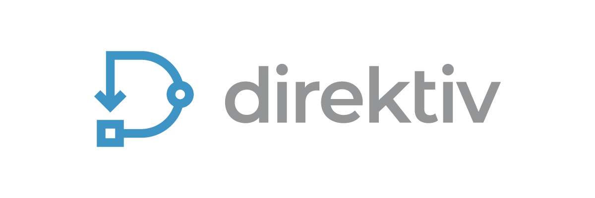
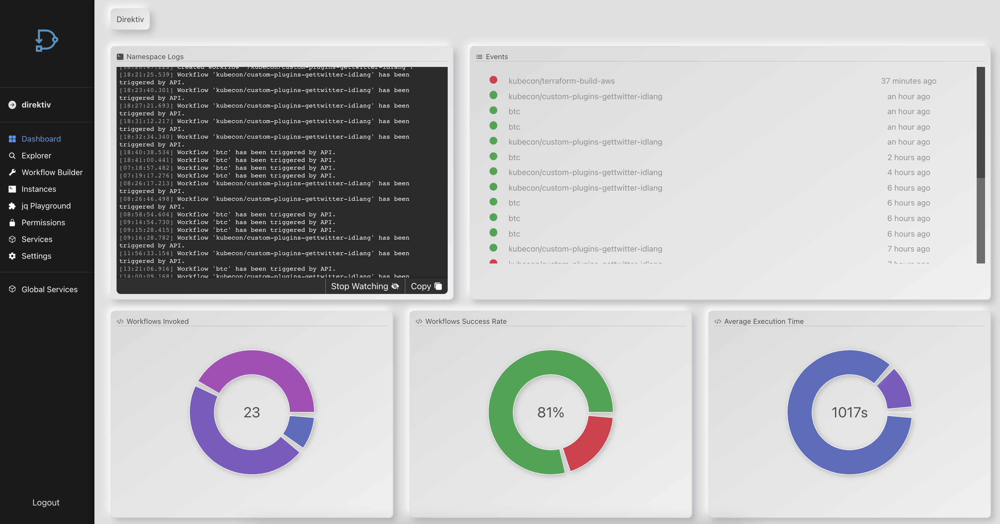
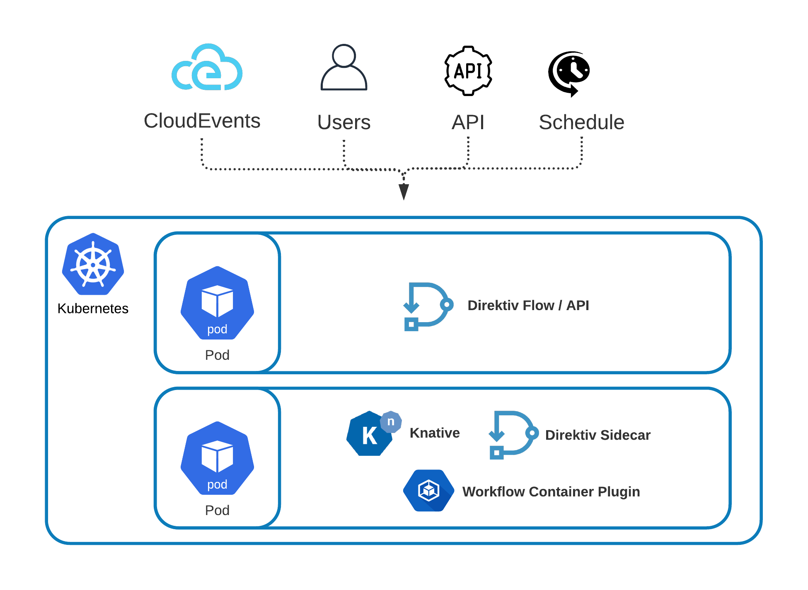
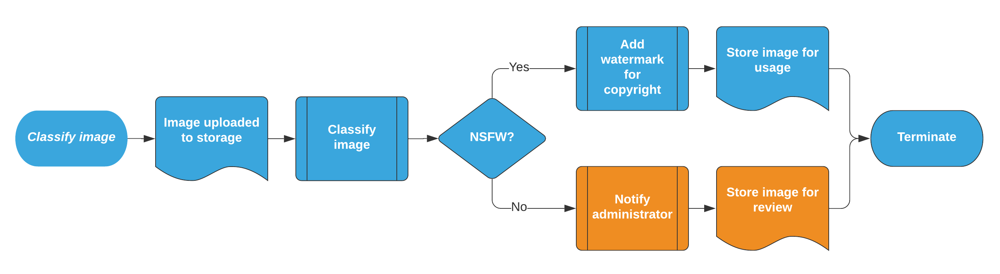
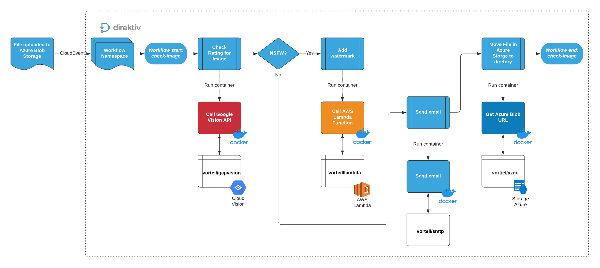

# direktiv

<br />

<p align="center">
  <a href="https://github.com/vorteil/direktiv">
    
  </a>
    <h5 align="center">event-based serverless container workflows</h5>
</p>
<hr/>

[](https://github.com/vorteil/direktiv/actions/workflows/build.yml) <a href="https://codeclimate.com/github/vorteil/direktiv/maintainability"></a> [](https://goreportcard.com/report/github.com/vorteil/direktiv) [](https://discord.gg/VjF6wn4)


## What is Direktiv?

**Direktiv is a serverless workflow and automation engine running on Kubernetes and Knative.**

Direktiv is the equivalent of AWS Step Functions, or Google Cloud Workflows or Alibaba Serverless Workflows. The difference between Direktiv and the cloud provider workflow engines is that Direktiv is cloud & platform agnostic, runs on kubernetes and executes containers as "plugins".

Direktiv defines a selection of intentionally primitive states, which can be strung together to create workflows as simple or complex as the author requires. The powerful `jq` JSON processor allows authors to implement sophisticated control flow logic, and when combined with the ability to run containers as part of Direktiv workflows just about any logic can be implemented.

Workflows can be triggered by CloudEvents for event-based solutions, can use cron scheduling to handle periodic tasks, and can be scripted using the APIs for everything else.

<p align="center">
  
</p>


## Direktiv Architecture

Direktiv runs as single pod on kubernetes but each workflow step can be executed on every pod in the system to achieve load balancing and high availability during workflow execution. It uses [Knative](https://knative.dev/) to execute containers as workflow actions.

<p align="center">
  
</p>


## Quickstart

### Docker Install

Getting a local playground environment can be easily done with Docker. The following command starts a docker container with kubernetes. *On startup it can take a few minutes to download all images.* When the installation is done all pods should show "Running" or "Completed".

```
docker run --privileged -p 8080:80 -ti vorteil/direktiv-kube
```


***Testing Installation:***

To test if the installation was successful go to http://localhost:8080 to access the UI.

For more information, documentation and examples visit the [documentation page](https://docs.direktiv.io/).


***Testing Direktiv***:

Download the `direkcli` command-line tool from the [releases page](https://github.com/vorteil/direktiv/releases)  and create your first namespace by running:

`direkcli namespaces create demo`

```bash
$ direkcli namespaces create demo
Created namespace: demo
$ direkcli namespaces list
+------+
| NAME |
+------+
| demo |
+------+
```

### Kubernetes Install

For full instructions on how to install Direktiv on a Kubernetes environment go to the [installation pages](https://docs.direktiv.io/docs/install.html)

### Workflow specification

The below example is the minimal configuration needed for a workflow, following the [workflow language specification](https://docs.direktiv.io/docs/specification.html):

```yaml
id: helloworld
states:
- id: hello
  type: noop
  transform: 
    msg: "Hello, jq(.name)!"
```

### Creating and Running a Workflow

The following script does everything required to run the first workflow. This includes creating a namespace & workflow and running the workflow the first time.  

```bash
$ direkcli namespaces create demo
Created namespace: demo
$ cat > helloworld.yml <<- EOF
id: helloworld
states:
- id: hello
  type: noop
  transform: 
    msg: "Hello, jq(.name)!"
EOF
$ direkcli workflows create demo helloworld.yml
Created workflow 'helloworld'
$ cat > input.json <<- EOF
{
  "name": "Alan"
}
EOF
$ direkcli workflows execute demo helloworld --input=input.json
Successfully invoked, Instance ID: demo/helloworld/aqMeFX <---CHANGE_THIS_TO_YOUR_VALUE
$ direkcli instances get demo/helloworld/aqMeFX
ID: demo/helloworld/aqMeFX
Input: {
  "name": "Alan"
}
Output: {"msg":"Hello, Alan!"}
```

### Direktiv plugins

Pre-built plugins are available from this Github repo - we're working hard to add more every day!

[https://github.com/vorteil/direktiv-apps](https://github.com/vorteil/direktiv-apps)

## Workflow Example

The below is a complex example of a process translated to a Direktiv workflow. Suppose a user would like to classify a image uploaded to the Azure Storage account as Not Safe For Work (NSFW). The process below is an example of what is needed:

Here is a process checking for NSFW images:

<p align="center">
  
</p>

- Image file is uploaded
- Image is automatically classified
- If it is SFW, then add a copyright watermark and move to a repository for usage
- It it is NSFW, notify the administrator and move to a seperate repository for analysis

This is how Direktiv would execute this process:

<p align="center">
  
</p>

- Image file is uploaded to an Azure Storage container and a CloudEvent is sent to Direktiv via webhook (matching Microsoft.Storage.BlobCreated)
- Direktiv workflow is configured to listen to the matching CloudEvent and starts the workflow
- Direktiv uses the Azure Blob URL and starts the vorteil/imagerecognition container hosted on Docker Hub (this container connects to the Google Vision API container for image classification)
- Direktiv receives the result for the analysis and does an internal match on the JSON data returned
- If the image is NSFW:
  - Direktiv starts the vorteil/smtp container (hosted in Docker Hub) and sends an email to the users passed as JSON data to the container
  - Direktiv starts the vorteil/azgo container (hosted in Docker Hub) and moves the image file to the appropriate container in Azure Storage
- If the image is SFW:
  - Direktiv starts the vorteil/lambda container (hosted in Docker Hub) and executes a pre-defined Lambda function to add a copyright watermark
  - Direktiv starts the vorteil/azgo container (hosted in Docker Hub) and moves the image file to the appropriate container in Azure Storage

The YAML file below shows the structure of the complex workflow:

```yaml
id: check-nsfw-image
description: "Classify an image uploaded to Azure Blob Storage as SFW or NSFW using Google Vision, AWS Lambda and Azure Storage functions"
start:
  type: event
  state: getRatingFromGoogleVision
  event:
    type: Microsoft.Storage.BlobCreated
functions:
- id: imageCheck
  type: reusable
  image: vorteil/imagerecognition:v2
- id: awslambda
  type: reusable
  image: vorteil/lambda:v2
- id: send-email
  type: reusable
  image: vorteil/smtp:v2
- id: azureupload
  type: reusable
  image: vorteil/azure-upload:v2
- id: azurecli
  type: reusable
  image: vorteil/azgo:v2
  size: large   
states:
- id: getRatingFromGoogleVision
  type: action
  action:
    secrets: ["GOOGLE_SERVICE_ACCOUNT_KEY"]
    function: imageCheck
    input: 
      url: jq(."Microsoft.Storage.BlobCreated".url)
      serviceAccountKey: jq(.secrets.GOOGLE_SERVICE_ACCOUNT_KEY)
  transition: checkRatingForImage
- id: checkRatingForImage
  log: jq(.)
  type: switch
  conditions:
  - condition: .return.safeForWork == true
    transition: addWaterMarkApproved
  defaultTransition: addWaterMarkNotApproved
- id: addWaterMarkApproved
  type: action
  action:
    function: awslambda
    secrets: ["LAMBDA_KEY", "LAMBDA_SECRET"]
    input:
      key: jq(.secrets.LAMBDA_KEY)
      secret: jq(.secrets.LAMBDA_SECRET)
      region: "ap-southeast-2"
      function: "python-watermark"
      body:
        imageurl: jq(."Microsoft.Storage.BlobCreated".url)
        message: "Approved by Direktiv.io"
  transform: '.notify = .return | del(.return)'
  transition: copyFileToSafeForWork
- id: addWaterMarkNotApproved
  type: action
  action:
    function: awslambda
    secrets: ["LAMBDA_KEY", "LAMBDA_SECRET"]
    input:
      key: jq(.secrets.LAMBDA_KEY)
      secret: jq(.secrets.LAMBDA_SECRET)
      region: "ap-southeast-2"
      function: "python-watermark"
      body: 
        imageurl: jq(."Microsoft.Storage.BlobCreated".url)
        message: "Not approved by Direktiv.io"
  transform: 'jq(.notify = .return | del(.return))'
  transition: sendEmail
- id: sendEmail
  type: action
  log: jq(.)
  action:
    function: send-email
    secrets: ["GMAIL_PASSWORD"]
    input:
      from: "wilhelm.wonigkeit@vorteil.io"
      to: "wilhelm.wonigkeit@vorteil.io"
      subject: "Direktiv NSFW Image Workflow"
      message: "NSFW Image detected"
      server: "smtp.gmail.com"
      port: 587
      password: jq(.secrets.GMAIL_PASSWORD)
  transition: copyFileToNotSafeForWork
- id: copyFileToNotSafeForWork
  type: action
  log: jq(.)
  action:
    secrets: ["AZ_STORAGE_ACCOUNT", "AZ_STORAGE_KEY"]
    function: azureupload
    input:
      container: "not-safe-for-work"
      "storage-account": jq(.secrets.AZ_STORAGE_ACCOUNT)
      "storage-account-key": jq(.secrets.AZ_STORAGE_KEY)
      data: jq(.notify.body)
      "upload-name": jq(."Microsoft.Storage.BlobCreated".url | capture("(?<filename>[a-z.]+$)").filename)
  transition: cleanup
- id: copyFileToSafeForWork
  type: action
  log: jq(.)
  action:
    secrets: ["AZ_STORAGE_ACCOUNT", "AZ_STORAGE_KEY"]
    function: azureupload
    input:
      container: "safe-for-work"
      "storage-account": jq(.secrets.AZ_STORAGE_ACCOUNT)
      "storage-account-key": jq(.secrets.AZ_STORAGE_KEY)
      data: jq(.notify.body)
      "upload-name": jq(."Microsoft.Storage.BlobCreated".url | capture("(?<filename>[a-z.]+$)").filename)
  transition: cleanup
- id: cleanup
  type: action
  action:
    secrets: ["AZ_STORAGE_ACCOUNT", "AZ_NAME", "AZ_PASSWORD", "AZ_TENANT","AZ_STORAGE_KEY"]
    function: azurecli
    input:
      name: jq(.secrets.AZ_NAME)
      password: jq(.secrets.AZ_PASSWORD)
      tenant: jq(.secrets.AZ_TENANT)
      command: ["storage", "blob", "delete", "--container", "processing", "--name", jq(."Microsoft.Storage.BlobCreated".url | split("processing/")[1]), "--account-name", jq(.secrets.AZ_STORAGE_ACCOUNT), "--account-key", jq(.secrets.AZ_STORAGE_KEY)]
```

## Why use Direktiv?

- *Cloud agnostic*: we wanted Direktiv to run on any platform or cloud, support any code or capability and NOT be dependent on the cloud provider's services for running the workflow or executing the actions (but obviously support it all)
- *Simplicity*: the configuration of the workflow components should be simple more than anything else. Using only YAML and `jq` you should be able to express all workflow states, transitions, evaluations and actions needed to complete the workflow
- *Reusable*: if you're going to the effort and trouble of pushing all your microservices, code or application components into a container platform why not have the ability to reuse and standardise this code across all of your workflows. We wanted to ensure that your code always remains reusable and portable and not tied into a specific vendor format or requirement (or vendor specific language).


## Code of Conduct

We have adopted the [Contributor Covenant](https://github.com/vorteil/.github/blob/master/CODE_OF_CONDUCT.md) code of conduct.

## Contributing

Any feedback and contributions are welcome. Read our [contributing guidelines](https://github.com/vorteil/.github/blob/master/CONTRIBUTING.md) for details.

## License

Distributed under the Apache 2.0 License. See `LICENSE` for more information.

## See Also

* The [direktiv.io](https://direktiv.io/) website.
* The [vorteil.io](https://github.com/vorteil/vorteil/) repository.
* The Direktiv [documentation](https://docs.direktiv.io/).
* The [Godoc](https://godoc.org/github.com/vorteil/direktiv) library documentation.
