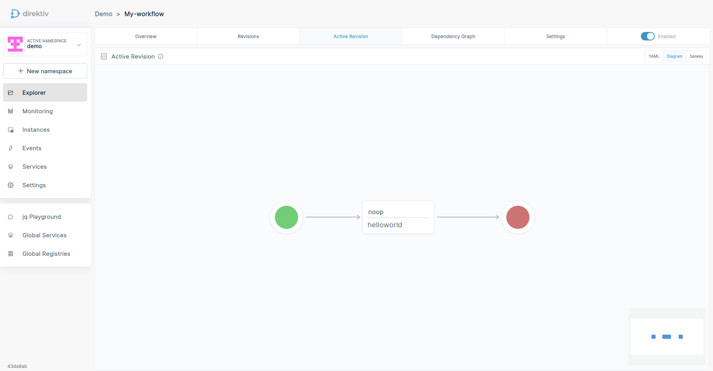

This repository contains the user interface for [direktiv](https://github.com/direktiv/direktiv). 

  

# Code of Conduct

We have adopted the [Contributor Covenant](https://github.com/direktiv/.github/blob/master/CODE_OF_CONDUCT.md) code of conduct.

# Contributing

Any feedback and contributions are welcome. Read our [contributing guidelines](https://github.com/direktiv/.github/blob/master/CONTRIBUTING.md) for details.
# License

Distributed under the Apache 2.0 License. See `LICENSE` for more information.

# See Also

* The [direktiv.io](https://direktiv.io/) website.
* The direktiv [documentation](https://docs.direktiv.io/).
* The direktiv [blog](https://blog.direktiv.io/).
* The [Godoc](https://godoc.org/github.com/direktiv/direktiv) library documentation.
