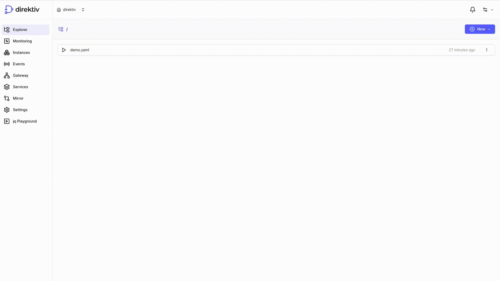

<p align="center">
  
</p>

<br>

<div align="center">

[](#license)
[](https://goreportcard.com/report/github.com/direktiv/direktiv) 
[](https://github.com/direktiv/direktiv/releases/)
[](https://github.com/direktiv/direktiv/stargazers/)
[](https://github.com/direktiv/badges/graphs/contributors/)
[](https://github.com/direktiv/direktiv/graphs/commit-activity)
[](https://go.dev/)
[](https://join.slack.com/t/direktiv-io/shared_invite/zt-zf7gmfaa-rYxxBiB9RpuRGMuIasNO~g)

</div>


<h1 align="center">Event-Driven Serverless Orchestration, Integration and Automation</h1>
<div align="center">
Run Workflows and Create Services in Seconds
</div>
</br>

<p align="center">
    <a href="https://docs.direktiv.io">Documentation</a>
    ·
    <a href="https://blog.direktiv.io">Blog</a>
    ·
    <a href="https://github.com/direktiv/direktiv/issues/new?assignees=&labels=&projects=&template=bug_report.md&title=">Report Bug</a>
    ·
    <a href="https://github.com/direktiv/direktiv/issues/new?assignees=&labels=&projects=&template=feature_request.md&title=">Request Feature</a>
</p>


<div align="center"></div>

## Features & Standards

* __YAML__: Define flows and subflows with simple YAML including if/else switches, error handling, retries, validations and more.
* __Serverless__: Call multiple serverless functions from a flow and merge and modify the responses to a single consumable function call.
* __Event-Based__: Catch events within the system or from external sources like AWS or Github and execute flows based on that event.
* __JSON Inputs & States__: Use JSON as input for flows and respond with JSON to the caller. JSON will be saved between the states fo a flow.
* __API Gateway__: Includes an API gateway to expose flows as services for third-party consumers including authentication.
* __CloudEvents__: Supports CNCF's [CloudEvents](https://cloudevents.io/) natively.
* __GitOps Approach__: All configurations, services and flows can be synced from Git. Git becomes the single source of truth.
* __Observability__: Integrated into Prometheus (metrics), Fluent Bit (logging) & OpenTelemetry (instrumentation & tracing).
* __Periodic Tasks__: Call flows periodically via cron jobs for repeating tasks. 
* __Scalable__: Direktiv scales on mulitple levels with Kubernetes scaling and [Knative's](https://knative.dev/docs/) scaling features.
* __Easily Extendable__: Add custom functions with simple Docker containers.

## Quick Start

Direktiv provides a Docker container with all required components pre-installed (Linux only). The initial startup can take a couple of minutes to download all required images.

```sh
docker run --privileged -p 8080:80 -ti direktiv/direktiv-kube
```

> If the upper limit for inotify instances is too low the pods might be stuck in *pending*. Increase that limit if necessary with the command `sudo sysctl fs.inotify.max_user_instances=4096`

If you are not using Linux please follow the [installation instructions](https://docs.direktiv.io/installation/kubernetes/) on the documentation page. 


## About Direktiv

Direktiv is an event-driven workflow engine made for **orchestration**, **integration**, and **automation**. In it's core it is a state machine which uses containers as functions within workflows and passes JSON structured data between states. It offers key features like retries, error handling, and conditional logic. The flow's state, stored as JSON, allows for dynamic transformations during execution using JQ or JavaScript.

<table align="center">
  <tr>
  <td>

```yaml
direktiv_api: workflow/v1
states:
- id: start
  type: noop
  transform:
    result: Hello world!
  transition: second
- id: second
  type: noop
  log: second state
  transform:
    final: this value is from state one jq(.result)
```
  </td>
  <td>
    
  </td>
  </tr>
</table>

Workflows can be triggered by events, start periodically via crons or can be started by a HTTP POST request where the data is the initial state fo the workflow. 

## Writing Workflows

Writing workflows is a very simple task. The basic idea is that there are multiple states where the workflow steps through. These states are of different types to provide switches, errors or other functionality. The most important type is the `action` state. This state calls a function which is basically a simple container.

Writing workflows is quite simple. Essentially, a workflow is progressing through different states with a JSOJ payload passed between those states. These states come in various types, providing switches, error management, and more. The most important type is the `action` state. The `action` state is basically a call to a container. Internally Direktiv spins up a serverless Knative function and passes data to that container. The response of that call becomes part of the JSON state of the flow.

```yaml
direktiv_api: workflow/v1

functions:
- id: request
  image: gcr.io/direktiv/functions/http-request:1.0
  type: knative-workflow

states:
- id: joke 
  type: action
  action:
    function: request
    input: 
      method: GET
      url: https://api.chucknorris.io/jokes/random?category=jq(.category // "dev")
  transform:
    joke: jq(.return[0].result.value)

```

The above example is a very simple one-step workflow. It uses the `http-request` function. This function accepts multiple input parameters e.g. the HTTP method or the URL. The section under `input` defines the data send to the function as JSON. In this case Direktiv would post the following payload to the container:

```json
{
  "method": "GET",
  "url": "https://api.chucknorris.io/jokes/random?category=dev"
}
```

In this example, there's a JQ statement, `jq(.category // "dev")`, which is getting evaluated at runtime. If the 'category' value is defined in the state, it's utilized in the URL; otherwise, `dev` is used as the default. For instance, initiating the workflow with a payload like `{ "category": "animal" }` would result in the URL: `https://api.chucknorris.io/jokes/random?category=animal`.

The state can be transformed after each state of the workflow. In this case the JQ command fetches the joke from the return values of the function and sets it as new state.

### Custom Functions

Although every [standard container](https://docs.direktiv.io/getting_started/advanced/making-functions/#using-generic-containers) can be used in Direktiv it is easy to write a custom function if necessary. The basic requirement for a custom function is a container listening to port `8080` and accepting JSON as a payload. There is more information about writing custom functions in the [documentation](https://docs.direktiv.io/getting_started/advanced/making-functions/) but the following code snippet shows a very simple Rust example of a a custom function.

```rust
use actix_web::{App, HttpResponse, HttpServer, Responder, post};
use actix_web::web::Json;

use serde::{Deserialize, Serialize};

#[derive(Deserialize)]
struct Input {
    name: String,
}

#[derive(Serialize)]
struct Output {
    greeting: String,
}

#[post("/")]
async fn index(info: Json<Input>) -> impl Responder {
    HttpResponse::Ok().json(Output { greeting: format!("Welcome to Direktiv, {}!", info.name) })
}

#[actix_rt::main]
async fn main() -> std::io::Result<()> {
    HttpServer::new(|| {
        App::new()
            .service(index)
    })
        .bind("0.0.0.0:8080")?
        .run()
        .await
}
```

## Documentation

- [Getting Started](https://docs.direktiv.io/getting_started/)
- [Workflow Specification](https://docs.direktiv.io/spec/workflow-yaml/workflow/)
- [Examples](https://docs.direktiv.io/examples/aws/)

## Talk to us!

- [Open Source Support Channel on Slack](https://join.slack.com/t/direktiv-io/shared_invite/zt-zf7gmfaa-rYxxBiB9RpuRGMuIasNO~g)


## Code of Conduct

We have adopted the [Contributor Covenant](https://github.com/direktiv/.github/blob/master/CODE_OF_CONDUCT.md) code of conduct.

## Contributing

Any feedback and contributions are welcome. Read our [contributing guidelines](https://github.com/direktiv/.github/blob/master/CONTRIBUTING.md) for details.

## License

Distributed under the Apache 2.0 License. See `LICENSE` for more information.

## See Also

* The [direktiv.io](https://direktiv.io/) website.
* The direktiv [documentation](https://docs.direktiv.io/).
* The direktiv [blog](https://blog.direktiv.io/).
* The [Godoc](https://godoc.org/github.com/direktiv/direktiv) library documentation.
