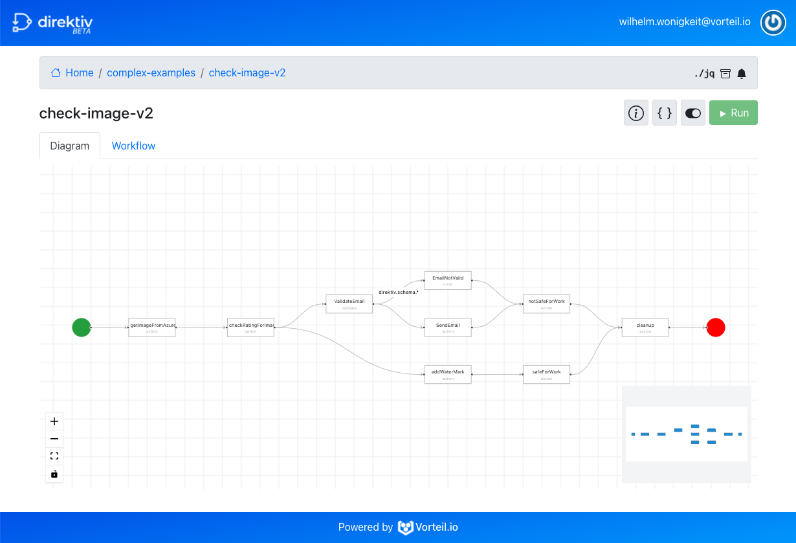
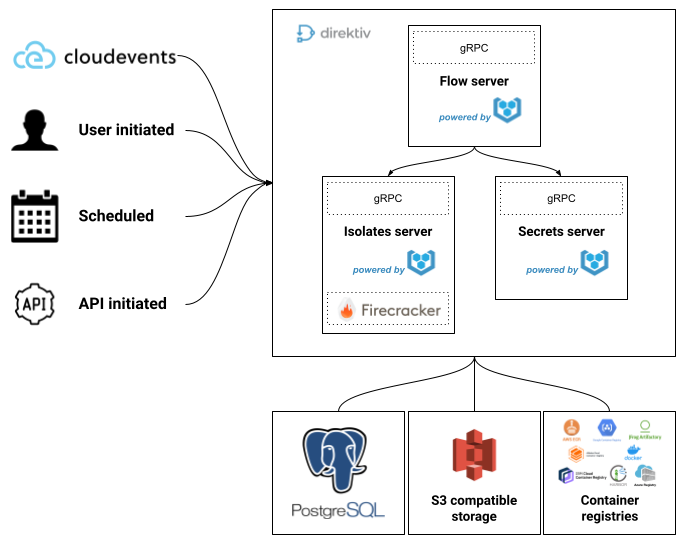

# direktiv

<br />

<p align="center">
  <a href="https://github.com/vorteil/direktiv">
    
  </a>
    <h5 align="center">event-based serverless container workflows</h5>
</p>
<hr/>

[](https://github.com/vorteil/direktiv/actions/workflows/build.yml) <a href="https://codeclimate.com/github/vorteil/direktiv/maintainability"></a> [](https://goreportcard.com/report/github.com/vorteil/direktiv) [](https://discord.gg/VjF6wn4)

**The Direktiv Beta is available now!**

<p align="center">
  <a href="https://wf.direktiv.io/">
    
  </a>
    <h5 align="center">Online Direktiv Beta now Available</h5>
</p>

## What is Direktiv?

**Diretiv is a serverless workflow engine.** 

Direktiv is the equivalent of AWS Step Functions, or Google Cloud Workflows or Alibaba Serverless Workflows. The difference between Direktiv and the cloud provider workflow engines is that Direktiv is cloud & platform agnostic, can run on container platforms and executes containers as "plugins".

Direktiv defines a selection of intentionally primitive states, which can be strung together to create workflows as simple or complex as the author requires. The powerful `jq` JSON processor allows authors to implement sophisticated control flow logic, and when combined with the ability to run containers as part of Direktiv workflows just about any logic can be implemented.

Workflows can be triggered by CloudEvents for event-based solutions, can use cron scheduling to handle periodic tasks, and can be scripted using the APIs for everything else.

## Quickstart

### Starting the Server

Getting a local playground environment can be easily done with either [Vorteil.io](github.com/vorteil/vorteil) or Docker. Direktiv's default isolation level is firecracker based on vorteil
machines. This behaviour can be changed in the configuration file or via environment variable.

****

***Using Docker:***

_Firecracker Isolation_


`docker run --privileged -p6666:6666 -eDIREKTIV_INGRESS_BIND=0.0.0.0:6666 vorteil/direktiv`


_Container Isolation:_

`docker run --privileged -p6666:6666 -eDIREKTIV_INGRESS_BIND=0.0.0.0:6666 -eDIREKTIV_ISOLATION=container vorteil/direktiv`

*Note: *

- *You may need to run this command as an administrator.*

- *In a public cloud instance, nested virualization is needed to support the firecracker micro-VMs. Each public cloud provider has different configuration settings which need to be applied to enable nested virtualization. Examples are shown below for each public cloud provider:*
  - [Google Cloud Platform](https://cloud.google.com/compute/docs/instances/enable-nested-virtualization-vm-instances)
  - Amazon Web Services (only supported on bare metal instances)
  - [Microsoft Azure](https://docs.microsoft.com/en-us/azure/virtual-machines/windows/nested-virtualization)
  - Alibaba (only supported on bare metal instances)
  - [Oracle Cloud](https://blogs.oracle.com/cloud-infrastructure/nested-kvm-virtualization-on-oracle-iaas)
  - [VMware](https://communities.vmware.com/t5/Nested-Virtualization-Documents/Running-Nested-VMs/ta-p/2781466)


***Using Vorteil:***

With Vorteil installed (full instructions [here](https://github.com/vorteil/vorteil)):

 1. download `direktiv.vorteil` from the [releases page](https://github.com/vorteil/direktiv/releases),
 2. run one of the following commands from within your downloads folder:

  `vorteil run direktiv.vorteil` for firecracker/vorteil isolation

   `vorteil run --program[2].env="DIREKTIV_ISOLATION=container" direktiv.vorteil` for container isolation


***Testing Direktiv***:

Download the `direkcli` command-line tool from the [releases page](https://github.com/vorteil/direktiv/releases)  and create your first namespace by running:

`direkcli namespaces create demo`

```bash
$ direkcli namespaces create demo
Created namespace: demo
$ direkcli namespaces list
+------+
| NAME |
+------+
| demo |
+------+
```

### Workflow specification

The below example is the minimal configuration needed for a workflow, following the [workflow language specification](https://docs.direktiv.io/docs/specification.html):

```yaml
id: helloworld
states:
- id: hello
  type: noop
  transform: '{ msg: ("Hello, " + .name + "!") }'
```

### Creating and Running a Workflow

The following script does everything required to run the first workflow. This includes creating a namespace & workflow and running the workflow the first time.  

```bash
$ direkcli namespaces create demo
Created namespace: demo
$ cat > helloworld.yml <<- EOF
id: helloworld
states:
- id: hello
  type: noop
  transform: '{ msg: ("Hello, " + .name + "!") }'
EOF
$ direkcli workflows create demo helloworld.yml
Created workflow 'helloworld'
$ cat > input.json <<- EOF
{
  "name": "Alan"
}
EOF
$ direkcli workflows execute demo helloworld --input=input.json
Successfully invoked, Instance ID: demo/helloworld/aqMeFX <---CHANGE_THIS_TO_YOUR_VALUE
$ direkcli instances get demo/helloworld/aqMeFX
ID: demo/helloworld/aqMeFX
Input: {
  "name": "Alan"
}
Output: {"msg":"Hello, Alan!"}
```

### Direktiv plugins

Pre-built plugins are available from this Github repo - we're working hard to add more every day!

[https://github.com/vorteil/direktiv-apps](https://github.com/vorteil/direktiv-apps)

### Roadmap

- Installation instructions (Kubernetes, Non-Kubernetes environments, Container/Vorteil setting)
- Providing individual vorteil / docker containers for individual components (workflow, isolates etc.)
- HTTP API & Simple UI
- Service Mesh configuration

## Workflow Example

The below is a complex example of a process translated to a Direktiv workflow. Suppose a user would like to classify a image uploaded to the Azure Storage account as Not Safe For Work (NSFW). The process below is an example of what is needed:

Here is a process checking for NSFW images:

<p align="center">
  
</p>

- Image file is uploaded
- Image is automatically classified
- If it is SFW, then add a copyright watermark and move to a repository for usage
- It it is NSFW, notify the administrator and move to a seperate repository for analysis

This is how Direktiv would execute this process:

<p align="center">
  
</p>

- Image file is uploaded to an Azure Storage container and a CloudEvent is sent to Direktiv via webhook (matching Microsoft.Storage.BlobCreated)
- Direktiv workflow is configured to listen to the matching CloudEvent and starts the workflow
- Direktiv uses the Azure Blob URL and starts the vorteil/imagerecognition container hosted on Docker Hub (this container connects to the Google Vision API container for image classification)
- Direktiv receives the result for the analysis and does an internal match on the JSON data returned
- If the image is NSFW:
  - Direktiv starts the vorteil/smtp container (hosted in Docker Hub) and sends an email to the users passed as JSON data to the container
  - Direktiv starts the vorteil/azgo container (hosted in Docker Hub) and moves the image file to the appropriate container in Azure Storage
- If the image is SFW:
  - Direktiv starts the vorteil/lambda container (hosted in Docker Hub) and executes a pre-defined Lambda function to add a copyright watermark
  - Direktiv starts the vorteil/azgo container (hosted in Docker Hub) and moves the image file to the appropriate container in Azure Storage

The YAML file below shows the structure of the complex workflow:

```yaml
id: check-image-v2
start:
  type: event
  state: getImageFromAzure
  event: 
    type: Microsoft.Storage.BlobCreated
functions:
- id: imageCheck
  image: vorteil/imagerecognition:v1
- id: azurego
  image: vorteil/azgo:v1
  size: large
- id: awslambda
  image: vorteil/lambda:v1
- id: send-email
  image: vorteil/smtp:latest
description: "Listen for an azure event upload to bucket" 
states:
- id: getImageFromAzure
  type: action
  action:
    secrets: ["GOOGLE_SERVICE_ACCOUNT_KEY"]
    function: imageCheck
    input: '{
      "url": ."Microsoft.Storage.BlobCreated".url,
      "serviceAccountKey": .secrets.GOOGLE_SERVICE_ACCOUNT_KEY    
    }'
  transition: checkRatingForImage
- id: checkRatingForImage
  type: switch
  conditions:
  - condition: .return.safeForWork == true
    transition: addWaterMark
  defaultTransition: ValidateEmail
- id: ValidateEmail
  type: validate
  subject: .email
  schema:
    type: string
    format: email
  catch:
  - error: direktiv.schema.*
    transition: EmailNotValid 
  transition: SendEmail
- id: EmailNotValid
  type: noop
  transform: '{ result: "Email not valid" }'
  transition: notSafeForWork
- id: SendEmail
  type: action
  action:
    function: send-email
    secrets: ["GOOOGLE_SMTP_PASSWORD"]
    input: '{
      "from": "support@vorteil.io",
      "to": .email,
      "subject": "SMTP Email",
      "message": "NSFW Image detected",
      "server": "smtp.gmail.com",
      "port": 587,
      "password": .secrets.GOOOGLE_SMTP_PASSWORD
    }'
  transition: notSafeForWork
- id: notSafeForWork
  type: action
  action:
    secrets: ["AZ_NAME", "AZ_PASSWORD", "AZ_TENANT","AZ_STORAGE_KEY"]
    function: azurego
    input: '{
      "name": .secrets.AZ_NAME,
      "password": .secrets.AZ_PASSWORD,
      "tenant": .secrets.AZ_TENANT,
      "command": ["storage", "blob", "copy", "start", "--destination-blob", (."Microsoft.Storage.BlobCreated".url | split("processing/")[1]), "--destination-container", "not-safe-for-work", "--source-container", "processing", "--source-blob", (."Microsoft.Storage.BlobCreated".url | split("processing/")[1]), "--account-key", .secrets.AZ_STORAGE_KEY, "--account-name", "direktiv"]
    }'
  transition: cleanup
- id: addWaterMark
  type: action 
  action: 
    function: awslambda 
    secrets: [lambdaKey, lambdaSecret]
    input: '{
      key: .secrets.lambdaKey,
      secret: .secrets.lambdaSecret,
      function: "-pnt-workflow-master-sns-publish:release",
      body: {
        Url: ."Microsoft.Storage.BlobCreated".url
        TransactionId: .transactionId,
        Payload: .requestType,
        StateName: "AddWaterMarkImage"
      }
    }'
  transform: '.notify = .return | del(.return)'
  transition: safeForWork
- id: safeForWork
  type: action
  action:
    secrets: ["AZ_NAME", "AZ_PASSWORD", "AZ_TENANT","AZ_STORAGE_KEY"]
    function: azurego
    input: '{
      "name": .secrets.AZ_NAME,
      "password": .secrets.AZ_PASSWORD,
      "tenant": .secrets.AZ_TENANT,
      "command": ["storage", "blob", "copy", "start", "--destination-blob", (."Microsoft.Storage.BlobCreated".url | split("processing/")[1]), "--destination-container", "safe-for-work", "--source-container", "processing", "--source-blob", (."Microsoft.Storage.BlobCreated".url | split("processing/")[1]), "--account-key", .secrets.AZ_STORAGE_KEY, "--account-name", "direktiv"]
    }'
  transition: cleanup
- id: cleanup
  type: action
  action:
    secrets: ["AZ_NAME", "AZ_PASSWORD", "AZ_TENANT","AZ_STORAGE_KEY"]
    function: azurego
    input: '{
      "name": .secrets.AZ_NAME,
      "password": .secrets.AZ_PASSWORD,
      "tenant": .secrets.AZ_TENANT,
      "command": ["storage", "blob", "delete", "--container", "processing", "--name", (."Microsoft.Storage.BlobCreated".url | split("processing/")[1]), "--account-name", "direktiv", "--account-key", .secrets.AZ_STORAGE_KEY]
    }'
```

The Direktiv Beta is available online now!

<p align="center">
  <a href="https://wf.direktiv.io/">
    
  </a>
    <h5 align="center">Online Direktiv Beta now Available</h5>
</p>

## Why use Direktiv?

Direktiv was created to address 4 problems faced with workflow engines in general:

- *Cloud agnostic*: we wanted Direktiv to run on any platform or cloud, support any code or capability and NOT be dependent on the cloud provider's services for running the workflow or executing the actions (but obviously support it all)
- *Simplicity*: the configuration of the workflow components should be simple more than anything else. Using only YAML and `jq` you should be able to express all workflow states, transitions, evaluations and actions needed to complete the workflow
- *Reusable*: if you're going to the effort and trouble of pushing all your microservices, code or application components into a container platform why not have the ability to reuse and standardise this code across all of your workflows. We wanted to ensure that your code always remains reusable and portable and not tied into a specific vendor format or requirement (or vendor specific language).
- *Multi-tenanted and secure*: we want to use Direktiv in a multi-tenant service provider space, which means all workflow executions have to be isolated, data access secured and isolated and all workflows and actions are truly ephemeral (or serverless).

## Direktiv internals?

This repository contains a reference implementation that runs Docker containers as isolated virtual machines on [Firecracker](https://github.com/firecracker-microvm/firecracker) using [Vorteil.io](github.com/vorteil/vorteil).

<p align="center">
  
</p>


## Code of Conduct

We have adopted the [Contributor Covenant](https://github.com/vorteil/.github/blob/master/CODE_OF_CONDUCT.md) code of conduct.

## Contributing

Any feedback and contributions are welcome. Read our [contributing guidelines](https://github.com/vorteil/.github/blob/master/CONTRIBUTING.md) for details.

## License

Distributed under the Apache 2.0 License. See `LICENSE` for more information.

## See Also

* The [direktiv.io](https://direktiv.io/) website.
* The [vorteil.io](https://github.com/vorteil/vorteil/) repository.
* The Direktiv [documentation](https://docs.direktiv.io/).
* The [Direktiv Beta UI](http://wf.direktiv.io/).
* The [Godoc](https://godoc.org/github.com/vorteil/direktiv) library documentation.
