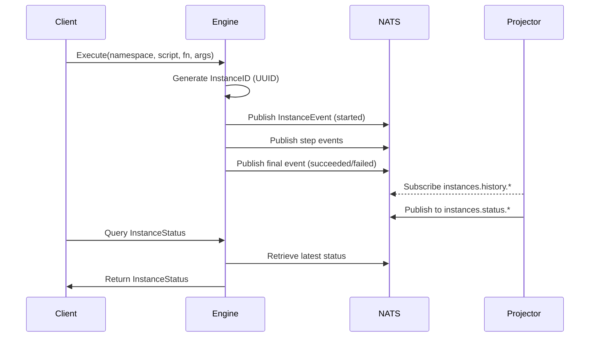

# Workflow Engine

## Overview
The Workflow Engine is a system for executing **JavaScript workflows**.  
It provides a runtime for executing scripts, tracking execution state, and persisting workflow history in **NATS JetStream**.  
Consumers can query both the **full history** of workflow executions and their **current status** via engine APIs.

---

## Core Concepts

### Workflow Execution
- Workflows are **JavaScript scripts** executed inside a [goja](https://github.com/dop251/goja) runtime.
- Each execution is uniquely identified by a **UUID** (the *Instance ID*), generated at the beginning of every execution.
- Execution is tracked step by step through **events**, which are pushed to **nats**, stored persistently and used to build/materialize the workflow’s current status.

### Event Sourcing Model
The engine follows an **event-sourcing pattern**:
- **History Stream (`instances.history.<namespace>.<instanceID>`)**  
  Append-only log of all execution events for a given instance.  
  This is the *source of truth*.
- **Status Stream (`instances.status.<namespace>.<instanceID>`)**  
  Continuously updated projection of the current workflow state, built by the **Projector** component by consuming the history stream.  
  This is the *read-only view*.
---

## Main Components

### WorkflowRunner
Defines the API to execute workflows.

```go
type WorkflowRunner interface {
    Execute(
        ctx context.Context,
        namespace string,
        script string,
        fn string,
        args any,
        labels map[string]string,
    ) (uuid.UUID, error)
}
```

- `namespace` – logical grouping of workflows (multi-tenancy). 
- `script` – JS script source or identifier. 
- `fn` – entry function to execute. 
- `args` – input arguments to the workflow. 
- `labels` – metadata tags for classification/tracing. 
- Returns: `InstanceID (uuid.UUID)` identifying the execution.****

### Projector
Consumes the **history stream** and produces the **status stream**.

```go
type Projector interface {
    Start(lc *lifecycle.Manager) error
}
```
- Listens on `instances.history.<namespace>.<instanceID>`.
- Builds and updates the latest `InstanceStatus`.
- Publishes to `instances.status.<namespace>.<instanceID>`.

In HA environments, all engines should run the projector's process. The projector's implementation should be protected from race conditions.

### DataBus
Provides the transport and query interface.

```go
type DataBus interface {
    Start(lc *lifecycle.Manager) error
    PushInstanceEvent(ctx context.Context, event *InstanceEvent) error
    QueryInstanceStatus(ctx context.Context, filterNamespace string, filterInstanceID uuid.UUID) []InstanceStatus
}
```
#### Responsibilities:
- Push events into the `history stream`.
- Serve queries for the `status` of instances.


### Data Structures

#### InstanceEvent
Represents an event in the workflow history.

```go
type InstanceEvent struct {
    EventID    uuid.UUID
    InstanceID uuid.UUID
    Namespace  string
    Metadata   map[string]string
    Type       string
    Time       time.Time

    Script string
    Input  json.RawMessage
    Memory json.RawMessage
    Output json.RawMessage
    Error  string

    Sequence uint64 // history stream sequence
}
```
- `Type`: categorizes event (e.g., `started`, `failed`, `succeeded`). 
- `Sequence`: event ordering within the history stream. This field is filled by **nats** JetStreams.
  The **projector** uses it to protect against race conditions when updating the status stream.

#### InstanceStatus
Represents the `projected state` of a workflow instance.
```go
type InstanceStatus struct {
    InstanceID uuid.UUID
    Namespace  string
    Metadata   map[string]string
    Script     string
    Input      json.RawMessage
    Memory     json.RawMessage
    Output     json.RawMessage
    Error      string
    Status     string
    CreatedAt  time.Time
    EndedAt    time.Time

    HistorySequence uint64 // source history event
    Sequence        uint64 // status stream sequence
}

```
- `Status`:
  - "started" → pending
  - "failed" → failed
  - "succeeded" → complete
- `HistorySequence` links back to the latest event that produced this status. 
  The **projector** uses this field to protect against race conditions when updating the status stream.

### Message FLows
#### Execution Lifecycle


### Example usage
```go
id, err := runner.Execute(
    ctx,
    "my-namespace",                             // namespace
    "function foo{print(\"hello\");}",          // script
    "foo",                                      // entry function
    args,                                       // input payload
    map[string]string{                          // labels
        "worflowPath": "/hello.js",
        "userID": "42",
    },
)
if err != nil {
    log.Fatalf("failed to start workflow: %v", err)
}

fmt.Println("Workflow started with ID:", id)
```