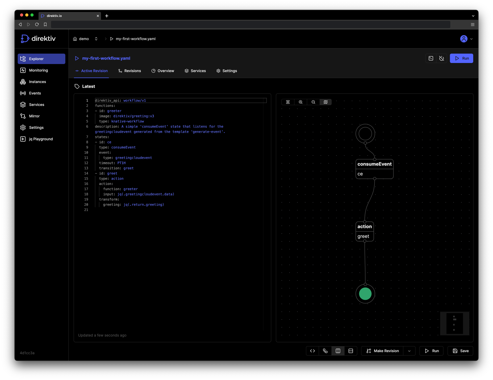

This repository contains the user interface for [direktiv](https://github.com/direktiv/direktiv).

  <picture>
    <source media="(prefers-color-scheme: dark)" srcset="assets/images/logo-dark.png">
    <source media="(prefers-color-scheme: light)" srcset="assets/images/logo-light.png">
    
</picture>

<picture>
  <source media="(prefers-color-scheme: dark)" srcset="assets/images/screenshot-dark.png">
  <source media="(prefers-color-scheme: light)" srcset="assets/images/screenshot-light.png">
  
</picture>

# Setup development environment

- this repo requires a specific node version, to easily install the correct one, please install [nvm](https://github.com/nvm-sh/nvm)
- in the root directory, run `nvm use` to automatically switch to the required version
  - which will be read from `.nvmrc` file
  - please note that you always must run `nvm use` in every terminal session
  - when the required nvm version is not installed on your machine yet, you have to run nvm install once to do so
- run `yarn` to install all dependencies
- create a `.env` file, copy the content from `.env.example` and change the variables to your needs
- run `yarn start` to start the dev server
- when you are using VSCode, make sure to install the recommended extensions for the best dev experience
  - VSCode should suggest you the extensions when you open this folder in VSCode, but you can also check them in the `.vscode/extensions.json` file

# Scripts you might want to run

- `yarn run storybook` opens the storybook and documentation
- `yarn run test` runs the tests in watch mode
- `yarn run check` runs all the checks that will run in CI:
  - `yarn run check:lint` runs the linter
  - `yarn run check:types` checks all types
  - `yarn run check:test` runs the tests in ci mode
  - `yarn run check:prettier` checks if all prettier formatting was applied (`yarn run prettier`)
- `yarn run e2e:headless` runs all Playwright e2e tests in headless mode
- `yarn run e2e:ui` runs all Playwright e2e tests in ui mode
- `yarn run preview` locally preview the production build (requires you to run `yarn build` first)

# Recommended Development Environment

## Visual Studio Code Users

If you're using [Visual Studio Code](https://code.visualstudio.com/) as your code editor, we highly recommend installing the extensions listed in the `.vscode/extensions.json` file. These extensions are designed to enhance your development experience by automatically resolving certain linting issues and formatting your code. When you open this project folder in VS Code for the first time, it should prompt you to install the recommended extensions.

## Non-VS Code Users

For those not using Visual Studio Code, we strongly recommend using [Prettier](https://prettier.io/) as your code formatter. Prettier will help you maintain a consistent code style, making it easier to collaborate with other developers. Prettier formatting checks will be enforced during the CI process.

# Code of Conduct

We have adopted the [Contributor Covenant](https://github.com/direktiv/.github/blob/master/CODE_OF_CONDUCT.md) code of conduct.

# Contributing

Any feedback and contributions are welcome. Read our [contributing guidelines](https://github.com/direktiv/.github/blob/master/CONTRIBUTING.md) for details.

# License

Distributed under the Apache 2.0 License. See `LICENSE` for more information.

# See Also

- The [direktiv.io](https://direktiv.io/) website.
- The direktiv [documentation](https://docs.direktiv.io/).
- The direktiv [blog](https://blog.direktiv.io/).
- The [Godoc](https://godoc.org/github.com/direktiv/direktiv) library documentation.
